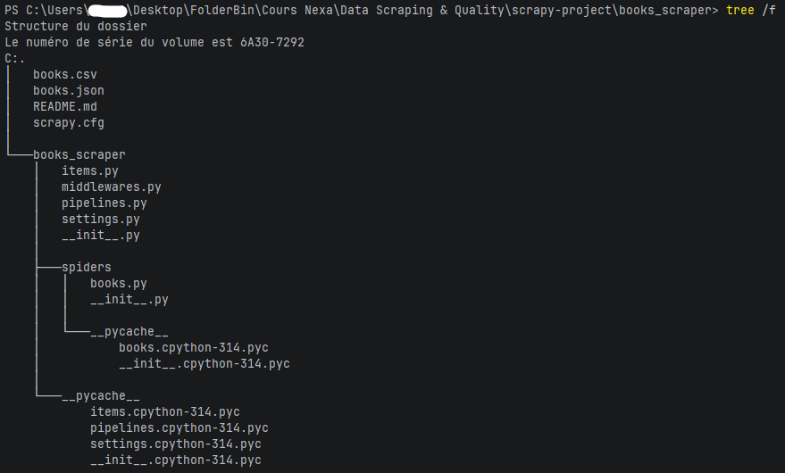

# Mini-projet

## Books_scraper

L'objectif du projet était donc de parcourir l'intégralité d'un site (books.toscrape.com), d'environ 1000 livres et 50 pages,<br/> à l'aide d'un crawler construit grâce à Scrapy.
Le spider (ou logique métier) sera donc en charge de multiples responsabilités, notamment :<br/>
- Détection des livres,
- Suivi sur la page de détail de chaque livre,
- Automatisation de la pagination,
- Nettoyage des données,
- Téléchargement des images et filtrages (Bonus). 

## Installation des dépendances

#### N.B. "py -m" rajouté à toute commande scrapy car variables d'environnement Python non setup sur configuration personnelle.

```
py -m venv venv
venv\Scripts\activate.bat
pip install -r requirements.txt
```

## Lancement du spider

```
py -m scrapy crawl books
```

## Exportation des données

### Pour le CSV
```
py -m scrapy crawl books -O books.csv
```

### Pour le Json
```
py -m scrapy crawl books -O books.json
```

## Structure finale du projet / crawler



## Commandes utilisés lors de la manipulation et vérification des données dans le projet

### Récupération 20 premières lignes (étape 1)

```
py -m scrapy shell "https://books.toscrape.com/"
response.css("article.product_pod")
book = response.css("article.product_pod")[0]
book.css("h3 a::attr(title)").get()
book.css(".price_color::text").get()
```

### Retour résultats BookItem

```
book.css(".star-rating::attr(class)").get()
book.css(".instock.availability::text").getall()
book.css("img::attr(src)").get()
```

### Ouverture page détail

```
scrapy shell "https://books.toscrape.com/catalogue/a-light-in-the-attic_1000/index.html"
response.css("#product_description ~ p::text").get()
response.css("ul.breadcrumb li:nth-child(3) a::text").get()
response.css("#product_gallery img::attr(src)").get()
```

### Activation pipeline dans settings.py

```
ITEM_PIPELINES = {
    "books_scraper.pipelines.CleaningPipeline": 300,
}
```
